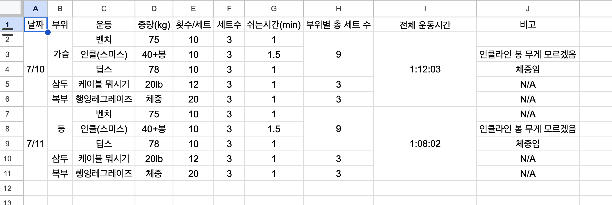

# [쇠질메이트 개발](https://iron-mate.com)을 위한 저장소입니다.

## 개요

매번 아이폰 노트에 중량운동 종목, 숫자 및 날짜 이 외에는 동일한 포맷으로 적는 것이 너무 귀찮음.

쉽게 기재할 수 있는 UI를 제공해주고 해당 데이터를 액셀로 관리할 수 있게 만들어주면 별도의 DB나 서버가 필요없어지므로 간단하게 개발 가능할것으로 사료됨.

## 기획

**V1. 화면내에 기재하여 액셀로 데이터 저장시키고 데이터 받아서 다시 화면에 띄워주는 것 까지 만들어놓기**

- **구글 광고 넣고, GA달기, Sentry는.. 일단 제외, 방명록 및 제안사항 작성은 Disqus로 진행하기**

- Train 페이지

  - [x] 각 부위와 종목을 기재할 수 있는 테이블 형태의 컴포넌트
  - [x] 각 종목의 시간을 측정할 수 있게 해주는 타이머 컴포넌트
  - [x] 날짜 변경시 해당 날에 대한 데이터들 렌더 시켜줘야함.
  - [x] 기재된 전체 데이터를 액셀로 추출할 수 있게 해주는 UX
  - [x] 형태에 맞는 액셀 데이터를 다시 홈페이지의 기존 UX에 업로드하여 사용할 수 있게 해주는 UX
  - [x] 타이머 한번 돌릴 때 마다 해당 테이블 셀의 세트수(set) 자동 상승 시켜주기

- History

  - [x] 날짜별 운동 유무를 나타내어 줄 달력 컴포넌트 (운동한날 + 운동시간 체크만 되는 목적)
  - [x] Detail버튼 클릭 시 Train페이지로 넘어가서 해당 날짜에 대한 데이터 모두 보여줘야 함.
  - [x] 주차별, 월별 운동 요약본을 타겟부위 별로 나타내어줄 요약 테이블 컴포넌트

- 기타

  - [ ] GithubAction CI/CD
  - [ ] 구글 애드센스
  - [ ] 타이머 도는 동안 광고

V2. 유저가 겁나 많아질 경우 해볼 듯.. 회원 DB로 관리하면서 회원별 데이터 수집하기

- ETC

  - 용어정리

    - Reps: Sets \*
    - Volume: 전체세트 X Reps X 무게
    - RPE(Rating of Perceived Execution): 10을 실패수행 지점으로 잡은 값임.
      - 1개 더 가능한 무게면 9, 하나도 못하면 10

  - 고민 포인트

    - 액셀 데이터 저장 및 파싱은 개인적으로 이상적이라 생각하는 정해진 형태가 존재함.
      
    - 저장하는 것은 라이브러리(xlsx)를 잘 사용하면 해결 될 것 같음.
    - 해당 데이터를 어떻게 가지고 있다가 파싱해서 날짜마다 보여줄지가 고민되는 지점.

      - 데이터를 어디에 저장해놓을까 (Web Storage? 용량이 될까? localStorage -> 용량 제한은 5MB 이 또한 브라우저 마다 다름.)
      - 그렇다고 서버를 돌리자니 비용도 비용이고 프로젝트가 복잡해지는 것이 걱정됨.

    - UX 자체적으로 액셀을 업로드하면 요약을 제공해주는 방식?
      - 형태가 깨진경우 에러처리에 대한 고민이 필요
      - 업로드해준 데이터는 바로 Parsing해서 State로 가지고 있어야함..
        - 어플리케이션이 꽤 느려질 것 같기도 🫠
